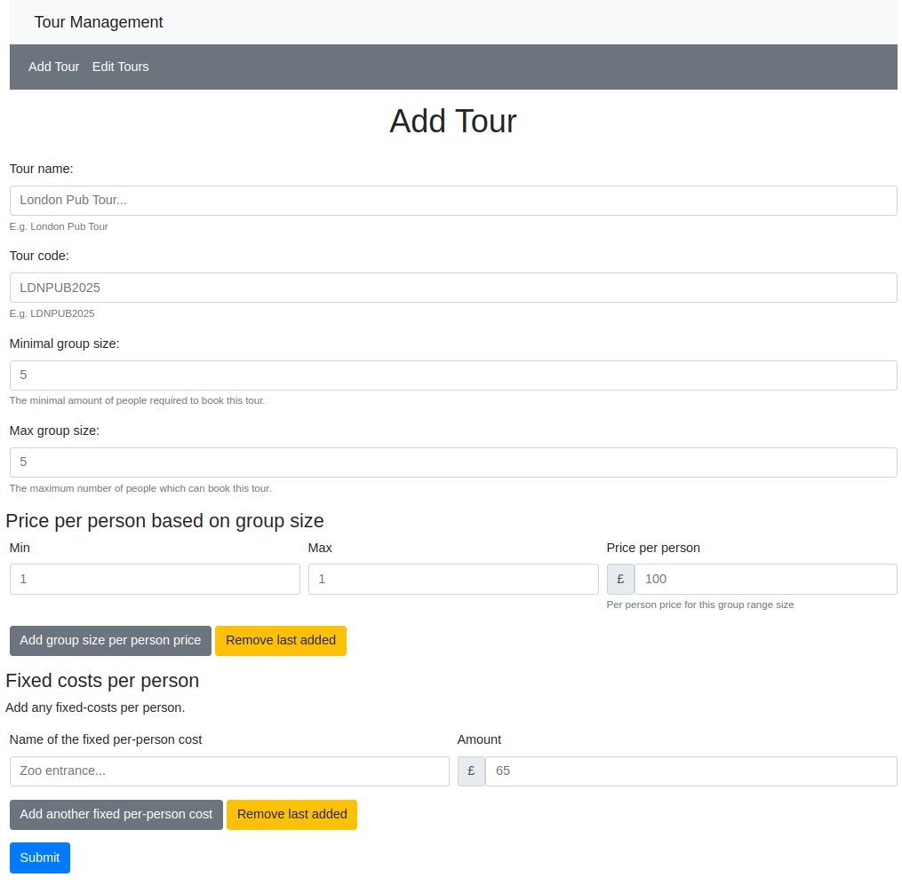

# Tour Management System

This project is a Tour Management System. It allows tour operators to add, edit, and manage tours with various pricing rules such as pricing based on based on group size, and taking into account fixed costs per person.

Per-person pricing can then more easily be calculated and presented back to customers wanting a quotation, whilst adjusting to the tour operators margins which change depending on the number of people attending.

Screenshot:


## Table of Contents

- Features
- Installation
- Usage
- Project Structure
- Contributing

## Features

- Add new tours with customisable pricing rules
- Edit existing tours
- Manage fixed costs per person and price per person based on group size
- Simple file based storage- no complex database required

## Installation

1. Clone the repository:

    ```sh
    git clone https://github.com/yourusername/tour-management-system.git
    cd tour-management-system
    ```

2. Create and activate a virtual environment:

    ```sh
    python3 -m venv venv
    source venv/bin/activate  # On Windows use `venv\Scripts\activate`
    ```

3. Install the required dependencies:

    ```sh
    pip install -r requirements.txt
    ```

## Usage

1. Run the Flask application:

    ```sh
    flask run
    ```

2. Open your web browser and navigate to `http://127.0.0.1:5000` to access the Tour Management System.

## Project Structure

```shell
tour-management-system/
├── app.py
├── requirements.txt
├── state/
├── templates/
│   ├── admin.html
│   ├── edit_tour.html
│   ├── layout.html
│   ├── list-tours.html
│   └── macros/
│       ├── fixed_person_cost_form_controls_template.html
│       └── group_size_price_per_person_form_controls_template.html
```

## Contributing

Contributions are welcome! Please fork the repository and submit a pull request with your changes.
